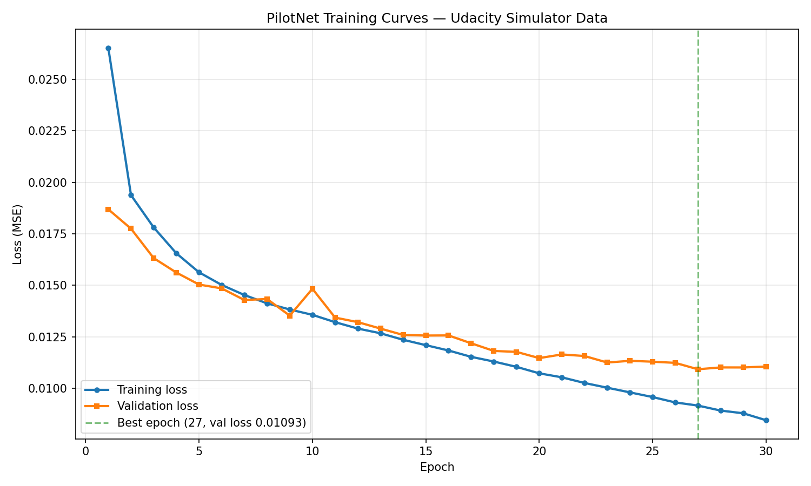
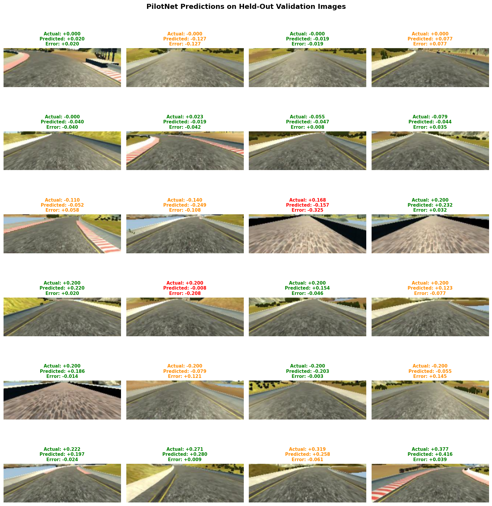
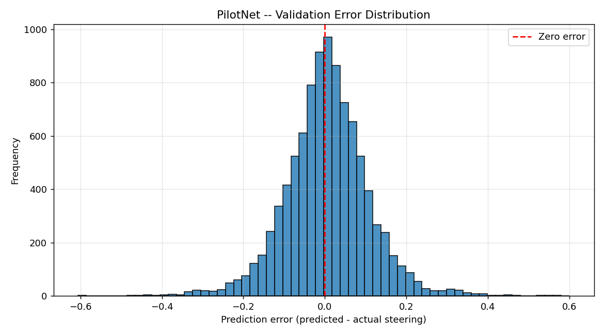

# PilotNet Reproduction

A faithful PyTorch reproduction of NVIDIA's PilotNet from the 2016 paper [*End to End Learning for Self-Driving Cars*](https://arxiv.org/abs/1604.07316), trained on the Udacity Self-Driving Car Simulator.

The model takes a single forward-facing camera frame and predicts the steering angle directly — no lane detection, no path planning, no hand-crafted features. End to end.

## Demo

A short clip of the trained model autonomously driving the Lake track in the Udacity simulator:

https://github.com/IamTemmy/pilotnet-reproduction/raw/main/results/demo.mp4

The model drove successfully for roughly 20 seconds before getting stuck on an unusually-textured bridge section — a failure mode I'll discuss in the Observations section below.

## Results at a glance

Evaluated on 9,642 held-out validation samples the model never saw during training:

| Metric | Value |
|---|---|
| Mean Absolute Error (MAE) | **0.077** |
| Mean Squared Error (MSE) | 0.0109 |
| Root Mean Squared Error (RMSE) | 0.105 |
| Predictions within 0.05 of true steering | 44.0% |
| Predictions within 0.10 of true steering | 72.3% |
| Predictions within 0.20 of true steering | 94.2% |

Steering values range from -1.0 (full left) to +1.0 (full right). An MAE of 0.077 means the typical prediction is off by ~7.7% of the full steering range — generally suitable for closed-loop driving.

## Training curves



30 epochs on ~38,500 augmented training samples, validated on ~9,600 held-out samples. Best validation loss of 0.01093 reached at epoch 27. The slight divergence between train and val loss in the final epochs is the onset of mild overfitting — captured by best-checkpoint saving so the deployed weights come from epoch 27, not epoch 30.

## Predictions on validation images



24 validation samples spanning the full range of steering magnitudes — straights, gentle curves, sharp turns. Titles are color-coded by prediction error: green (< 0.05), orange (< 0.15), red (≥ 0.15). The model handles straight and gentle-curve segments well; the larger errors cluster on sharp curves, which are the underrepresented edges of the training distribution.

## Error distribution



Prediction errors across the full validation set. Roughly bell-shaped and centered near zero, indicating no systematic bias toward over- or under-steering.

## What's in this repo

- `src/model.py` — PilotNet architecture, faithful to Figure 4 of the paper
- `src/dataset.py` — PyTorch Dataset for the Udacity simulator's CSV-based logs
- `src/augment.py` — multi-camera and horizontal-flip augmentation (~6× dataset expansion)
- `src/train.py` — training loop with leakage-safe train/val split and best-checkpoint saving
- `src/drive.py` — WebSocket inference server that drives the simulator in autonomous mode
- `src/evaluate.py` — quantitative evaluation on the held-out validation set
- `src/plot_training.py` — generates training-curve plot from saved history
- `docs/paper_notes.md` — notes on the PilotNet paper
- `docs/learning_log.md` — a written record of what I learned at each phase
- `results/` — demo video, training curves, prediction grid, error histogram, summary text
- `checkpoints/training_history.csv` — per-epoch train and val loss

## Architecture

PilotNet is a 9-layer CNN: 1 hardcoded normalization layer, 5 convolutional layers, 3 fully connected hidden layers, and a 1-unit regression output. Total: ~250,000 parameters. Input is a 66×200 RGB image (cropped to remove sky and hood, then resized). Output is a single scalar — the steering angle.

| Layer | Type | Output shape | Kernel | Stride |
|-------|------|--------------|--------|--------|
| 1 | Normalization (hardcoded) | 3×66×200 | — | — |
| 2 | Conv + ELU | 24×31×98 | 5×5 | 2 |
| 3 | Conv + ELU | 36×14×47 | 5×5 | 2 |
| 4 | Conv + ELU | 48×5×22 | 5×5 | 2 |
| 5 | Conv + ELU | 64×3×20 | 3×3 | 1 |
| 6 | Conv + ELU | 64×1×18 | 3×3 | 1 |
| 7 | FC + ELU | 100 | — | — |
| 8 | FC + ELU | 50 | — | — |
| 9 | FC + ELU | 10 | — | — |
| 10 | FC (linear) | 1 | — | — |

## How to run

```bash
# Install
python3 -m venv venv
source venv/bin/activate
pip install -r requirements.txt

# Download the Udacity sample data into data/udacity/ before training.
# Expected layout: data/udacity/driving_log.csv + data/udacity/IMG/*.jpg

# Train (30 epochs takes ~45 minutes on Apple M1 via MPS)
python -m src.train --epochs 30

# Evaluate on held-out validation set
python -m src.evaluate --model checkpoints/best.pth

# Plot training curves from saved history
python -m src.plot_training

# Drive the Udacity simulator in autonomous mode
python -m src.drive --model checkpoints/best.pth
# (then launch the simulator and click Autonomous Mode)
```

## Observations

Three things I noticed during real-time simulator driving that connect to real failure modes discussed in the autonomous-driving literature:

**Steering jitter.** The car drove the track but the steering was not smooth — it constantly micro-corrected left-right-left as it moved. This is a known limitation of single-frame regression models: PilotNet predicts steering from one image with no memory of its previous prediction, so successive frames can produce predictions that flip sign even when the road is roughly straight. Modern autonomous-driving systems address this with temporal smoothing on the output or with recurrent architectures that condition on history.

**Distributional shift / error compounding.** After about 30 seconds of driving, the car drifted slightly off-center on a cobblestone bridge section — a piece of road with a visually distinct texture that appears infrequently in the training data. A slightly-off prediction put the car in a position even further from anything seen during training, the next prediction was worse, and the failure compounded until the car got stuck on the curb. This is the canonical failure mode of behavioral cloning, formally studied as covariate shift between the training distribution (human-driven smooth trajectories) and the inference distribution (the policy's own slightly-imperfect trajectories). Approaches like DAgger (Dataset Aggregation) attack this by iteratively expanding the training data with states the policy itself visits.

**Mild overfitting in late epochs.** Training loss continued to decrease in epochs 28-30 while validation loss flattened and crept up slightly. Best-checkpoint saving handled this correctly — the deployed weights are from epoch 27, not the final epoch. This is what early stopping is conventionally used to detect; the best-checkpoint approach is functionally equivalent for this case.

## Acknowledgments

- Bojarski et al., NVIDIA, *End to End Learning for Self-Driving Cars*, 2016
- Udacity Self-Driving Car Engineer Nanodegree program for the open-source simulator and sample data

---
*Author: Temmy ([@IamTemmy](https://github.com/IamTemmy))*
